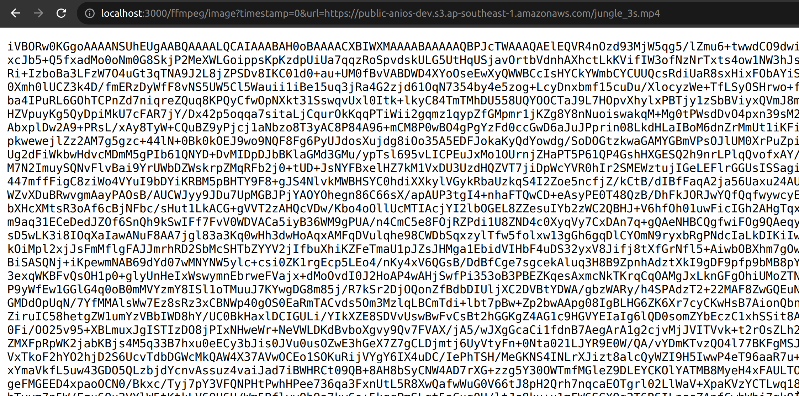
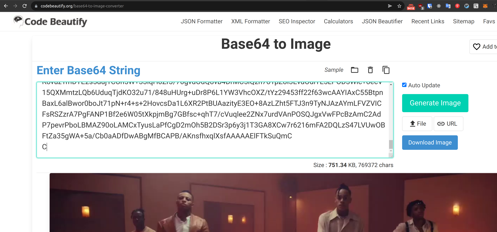

# Pixcap's assessment

## Preface
Hi there, I'm Thi, thank you for reading this README. I had fun doing this coding this assessment and thank you for giving such a good problem to the candidates.

To be honest, I don't have too much experience with Typescript because I'm more experienced with raw Nodejs and Golang and this is my first time using `tsoa` so I might not be able to follow the best practices. 

Also I want to write unit tests for this assessment but due to the time limitation, I skip unit tests part. Please forgive me :). I normally write a lot of unit tests in my daily coding so don't judge me for missing unit tests here.

## Documents

Build the project with docker
```
$ npm run build:docker
```

Start project with docker
```
$ npm run docker
```
Navigate to http://localhost:3000/docs/

If you already had an application running on port 3000, you can run the application with a different port

```
$ docker run -p 5000:3000 pixcap
```

### An example endpoint
```
http://localhost:3000/ffmpeg/image?timestamp=0&url=https://public-anios-dev.s3.ap-southeast-1.amazonaws.com/jungle_3s.mp4
```





Again, thank you very much for checking the assessment. I really appreciate your time!.